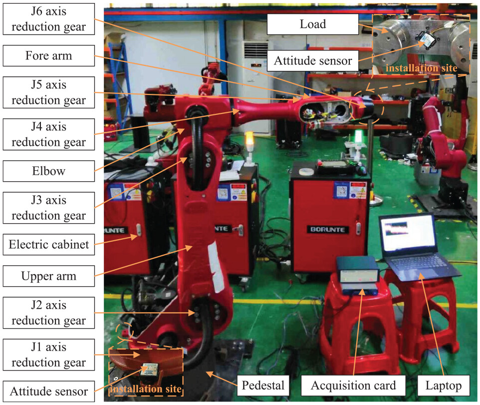
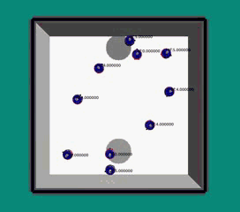

## About me

Hi! This is Yandong Luo, a master student in Computer Science at [Georgia Institute of Technology](https://www.gatech.edu/), where I'm advised by Prof. [Zhao Ye](https://www.me.gatech.edu/faculty/zhao). I'm broadly interested in Perception and Planning. My current research focuses on CUDA-based motion generation for Loco-manipulation.

Before coming to GaTech, I was working at [Tusimple](https://en.wikipedia.org/wiki/TuSimple) company for L2 and L4 trajectory planning and decision making of autonomous trucks operating in the bustling port of Shanghai, China. I obtained my master's degree at the [University of Illinois at Urbana Champaign](https://illinois.edu/), where I conducted research on perception and planning for autonomous vehicles under the supervision of Prof. Bob Norris. I completed my bachelor's degree in Mechanical Engieering at Dongguan University of Technology, where I was advised by Prof. Jianwen Guo. During my undergraduate period, I worked on multi-agent systems.


## Working Experience
<div style="display: flex; align-items: flex-start; margin-bottom: 15px;">
  
  <div>
    <h4 style="margin-top: 0; margin-bottom: 10px;">Tusimple Algorithm Engineer – Path Planning & Decision Making</h4>
    <p style="margin: 5px 0;">L2 Lateral Trajectory Optimization</p>
    <p style="margin: 5px 0;">L4 Game Theory for Lane Change</p>
    <p style="margin: 5px 0;"><a href="https://youtu.be/s14DXWlkX7A">[cut in]</a> <a href="https://youtu.be/JZBEnD1joCc">[lane change]</a></p>
  </div>
</div>

<div style="display: flex; align-items: flex-start; margin-bottom: 15px;">
  
  <div>
    <h4 style="margin-top: 0; margin-bottom: 10px;">Yelink Autonomous Vehicle Engineer</h4>
    <p style="margin: 5px 0;">Shenzhen Subway Autonomous Braking System</p>
    <!-- <p style="margin: 5px 0;">L4 Game Theory for Lane Change</p> -->
    <p style="margin: 5px 0;"><a href="https://youtu.be/iXHDc-L6YHo">[subway]</a></p>
  </div>
</div>

<!--  Tusimple Algorithm Engineer – Path Planning & Decision Making\\
 L2 Lateral Trajectory Optimization \\
 L4 Game Theory for Lane Change \\
 Autonomous Driving Engineer -->
<!--   -->

## Research Interest
*   Robot Learning
*   Autonomous Driving
*   Robot Perception

## Selected Research
<!--  Fault diagnosis of industrial robot reducer by an extreme learning machine with a level-based learning swarm optimizer\\
Jianwen Guo, Xiaoyan Li, Zhenpeng Lao, **Yandong Luo**, Jiapeng Wu, and Shaohui Zhang\\
Journal of Advances in Mechanical Engineering, 19 May 2021, Dongguan University of Technology
[paper](https://journals.sagepub.com/doi/10.1177/16878140211019540) -->
<div style="display: flex; align-items: flex-start; margin-bottom: 15px;">
  
  <div>
    <h4 style="margin-top: 0; margin-bottom: 10px;">Fault diagnosis of industrial robot reducer by an extreme learning machine with a level-based learning swarm optimizer</h4>
    <p style="margin: 5px 0;">Jianwen Guo, Xiaoyan Li, Zhenpeng Lao, <strong>Yandong Luo</strong>, Jiapeng Wu, and Shaohui Zhang</p>
    <p style="margin: 5px 0;">Journal of Advances in Mechanical Engineering, 19 May 2021, Dongguan University of Technology</p>
    <p style="margin: 5px 0;"><a href="https://journals.sagepub.com/doi/10.1177/16878140211019540">paper</a></p>
  </div>
</div>

<div style="display: flex; align-items: flex-start; margin-bottom: 15px;">
  
  <div>
    <h4 style="margin-top: 0; margin-bottom: 10px;">Swarm Robot Exploration Strategy for Path Formation Tasks Inspired by Physarum polycephalum</h4>
    <p style="margin: 5px 0;"><strong>Yandong Luo</strong>, Jianwen Guo, Zhenpeng Lao, Shaohui Zhang, Xiaohui Yan</p>
    <p style="margin: 5px 0;">Journal of Complexity, 19 May 2021, Dongguan University of Technology</p>
    <p style="margin: 5px 0;"><a href="https://onlinelibrary.wiley.com/doi/10.1155/2021/6698421">paper</a></p>
  </div>
</div>
\\

## Project
<!--  Fault diagnosis of industrial robot reducer by an extreme learning machine with a level-based learning swarm optimizer\\
Jianwen Guo, Xiaoyan Li, Zhenpeng Lao, **Yandong Luo**, Jiapeng Wu, and Shaohui Zhang\\
Journal of Advances in Mechanical Engineering, 19 May 2021, Dongguan University of Technology
[paper](https://journals.sagepub.com/doi/10.1177/16878140211019540) -->
<div style="display: flex; align-items: flex-start; margin-bottom: 15px;">
  
  <div>
    <h4 style="margin-top: 0; margin-bottom: 10px;">CUDA Parallel Acceleration of Footstep Planner and Controller</h4>
    <!-- <p style="margin: 5px 0;">Jianwen Guo, Xiaoyan Li, Zhenpeng Lao, <strong>Yandong Luo</strong>, Jiapeng Wu, and Shaohui Zhang</p>
    <p style="margin: 5px 0;">Journal of Advances in Mechanical Engineering, 19 May 2021, Dongguan University of Technology</p> -->
    <p style="margin: 5px 0;"><a href="https://journals.sagepub.com/doi/10.1177/16878140211019540">[Github repo]</a></p>
  </div>
</div>

<div style="display: flex; align-items: flex-start; margin-bottom: 15px;">
  
  <div>
    <h4 style="margin-top: 0; margin-bottom: 10px;">3D Object Detection and Tracking for Autonomous Vehicle</h4>
    <!-- <p style="margin: 5px 0;"><strong>Yandong Luo</strong>, Jianwen Guo, Zhenpeng Lao, Shaohui Zhang, Xiaohui Yan</p>
    <p style="margin: 5px 0;">Journal of Complexity, 19 May 2021, Dongguan University of Technology</p> -->
    <p style="margin: 5px 0;"><a href="https://github.com/Yandong-Luo/Reimplement-PointPillar">[Github repo]</a> <a href="https://youtu.be/gZP0zZ-1aUI">[Vehicle Test]</a><a href="https://youtu.be/2geS7mITpOo">[Tracking Test]</a><a href="https://youtu.be/5wYhJoQx21w">[KITTI Test]</a></p>
  </div>
</div>

<div style="display: flex; align-items: flex-start; margin-bottom: 15px;">
  
  <div>
    <h4 style="margin-top: 0; margin-bottom: 10px;">Path Planning of Reverse Parallel Parking</h4>
    <!-- <p style="margin: 5px 0;"><strong>Yandong Luo</strong>, Jianwen Guo, Zhenpeng Lao, Shaohui Zhang, Xiaohui Yan</p>
    <p style="margin: 5px 0;">Journal of Complexity, 19 May 2021, Dongguan University of Technology</p> -->
    <p style="margin: 5px 0;"><a href="https://github.com/Yandong-Luo/parallel_parking">[Github repo]</a> <a href="https://youtu.be/GD1N-XIS-Nw">[Vehicle Test]</a><a href="https://youtu.be/otTrGEX5Vzc">[Simulation Test]</a></p>
  </div>
</div>

 Swarm Robot Exploration Strategy for Path Formation Tasks Inspired by Physarum polycephalum\\
**Yandong Luo**, Jianwen Guo, Zhenpeng Lao, Shaohui Zhang, Xiaohui Yan\\
Journal of Complexity, 19 May 2021, Dongguan University of Technology
[paper](https://onlinelibrary.wiley.com/doi/10.1155/2021/6698421)

## Project
<!--   -->
Text can be **bold**, _italic_, or ~~strikethrough~~.

[Link to another page](./another-page.html).

There should be whitespace between paragraphs.

There should be whitespace between paragraphs. We recommend including a README, or a file with information about your project.

# Header 1

This is a normal paragraph following a header. GitHub is a code hosting platform for version control and collaboration. It lets you and others work together on projects from anywhere.

## Header 2

> This is a blockquote following a header.
>
> When something is important enough, you do it even if the odds are not in your favor.

### Header 3

```js
// Javascript code with syntax highlighting.
var fun = function lang(l) {
  dateformat.i18n = require('./lang/' + l)
  return true;
}
```

```ruby
# Ruby code with syntax highlighting
GitHubPages::Dependencies.gems.each do |gem, version|
  s.add_dependency(gem, "= #{version}")
end
```

#### Header 4

*   This is an unordered list following a header.
*   This is an unordered list following a header.
*   This is an unordered list following a header.

##### Header 5

1.  This is an ordered list following a header.
2.  This is an ordered list following a header.
3.  This is an ordered list following a header.

###### Header 6

| head1        | head two          | three |
|:-------------|:------------------|:------|
| ok           | good swedish fish | nice  |
| out of stock | good and plenty   | nice  |
| ok           | good `oreos`      | hmm   |
| ok           | good `zoute` drop | yumm  |

### There's a horizontal rule below this.

* * *

### Here is an unordered list:

*   Item foo
*   Item bar
*   Item baz
*   Item zip

### And an ordered list:

1.  Item one
1.  Item two
1.  Item three
1.  Item four

### And a nested list:

- level 1 item
  - level 2 item
  - level 2 item
    - level 3 item
    - level 3 item
- level 1 item
  - level 2 item
  - level 2 item
  - level 2 item
- level 1 item
  - level 2 item
  - level 2 item
- level 1 item

### Small image


### Large image


### Definition lists can be used with HTML syntax.

<dl>
<dt>Name</dt>
<dd>Godzilla</dd>
<dt>Born</dt>
<dd>1952</dd>
<dt>Birthplace</dt>
<dd>Japan</dd>
<dt>Color</dt>
<dd>Green</dd>
</dl>

```
Long, single-line code blocks should not wrap. They should horizontally scroll if they are too long. This line should be long enough to demonstrate this.
```

```
The final element.
```
